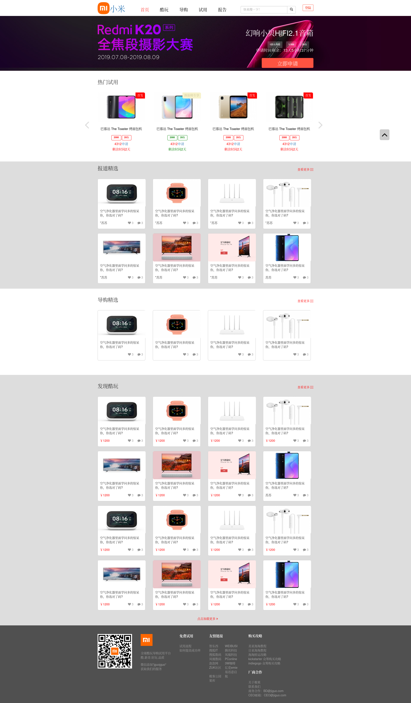

# 介绍

一个多功能的商城购物网站，可以实现的功能有版面商品自动轮播以及通过按钮手动轮播，点击加载更多商品图片，页面右边的正方形的箭头图形按钮可快速回到顶端，显示相关商品的热度和评论数，帐号登陆验证，将来会打算添加实现一个搜索商品的功能。

网站主要使用 jQuery 完成实现各种复杂的网站功能， 利用 MVC，即Model-View-Controller，中文名“模型-视图-控制器”的理念编写网页，通过Nunjucks模块把数据用指定的模板渲染成 HTML，然后输出给浏览器页面上，就可以看到渲染后的页面。koa 作为框架构建网站，这是一个简洁而灵活的 node.js Web 应用框架, 提供了一系列强大特性来创建各种 Web 应用，和丰富的 HTTP 工具。可以快速地搭建一个完整功能的网站。bootstrap 定义基本的 HTML 元素样式，内置自定义的组件，用于创建图像、下拉菜单、导航、警告框、弹出框等等，可以快速布局和更改 DOM 元素的样式，做出漂亮友好的网页页面。同时引入 Nunjucks 模块作为模板引擎控制网页的输出，方便编辑布局网页，减轻网页编辑的工作量。

# 运行环境：

安装 Git 以及拥有 npm 命令的任何 node 版本即可，测试环境使用的操作系统是 Archlinux，其他系统可以参考官网说明来完成下载安装。

安装 Git 、node 和 npm ：

```bash
sudo pacman -S nodejs npm git
```

# 使用

克隆下载仓库：

```bash
git clone git@github.com:Lanservery/Website.git
```

进入 下载好的 Website 目录里面，使用下面命令开始下载网站运行所需要的依赖。

下载依赖：

```bash
npm install
```

依赖下载完成后运行启动脚本命令，启动运行网页。

运行：

```bash
npm run start
```

在浏览器输入网址：[http://localhost:3000](http://localhost:3000) 即可查看。

# 预览

运行成功后的网页界面：


